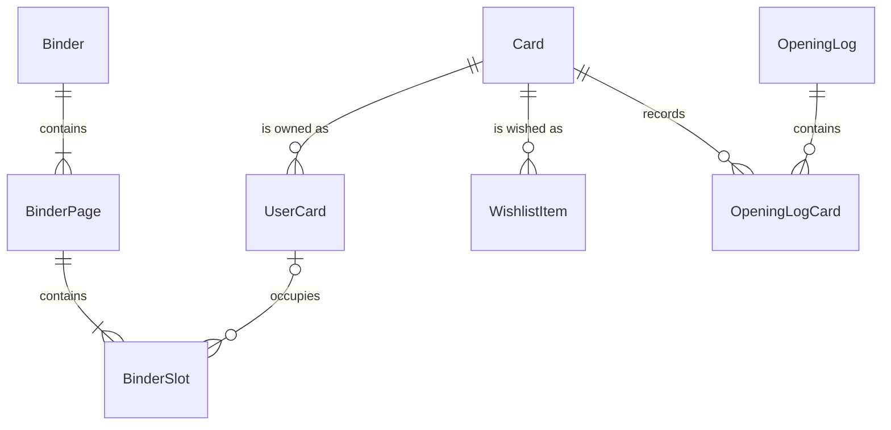

# Pokefolio 초기 ERD 초안

이 문서는 구현 전 데이터 모델 후보를 설명한다. 실제 SQLAlchemy 모델이나 Alembic migration이 아니며, 카드 데이터 제공자와 식별자 정책을 정한 뒤 필드와 타입을 확정한다.

[제품 비전](PRODUCT_VISION.md)이 Collection Journal 중심으로 변경되었으므로 기존 `OpeningLog` 초안은 확정 모델이 아니다. 아래 기존 엔티티는 영향 검토를 위한 기준으로 보존하고, 확장 또는 대체 후보는 문서 끝의 Open Questions에서 결정한다.

## 모델링 원칙

- SQLAlchemy 2.x typed declarative mapping을 사용한다.
- API 요청·응답용 Pydantic v2 스키마와 DB 모델을 분리한다.
- 모든 스키마 변경은 Alembic migration으로 관리한다.
- SQLite로 시작하되 PostgreSQL에서 의미가 달라지는 타입, native SQL, SQLite 전용 기능을 최소화한다.
- 시간은 timezone-aware UTC로 저장하고 API에서 ISO 8601 문자열로 표현한다.
- MVP는 로그인 없는 단일 사용자지만 사용자 소유 경계를 나중에 추가할 수 있게 서비스 계층에서 단일 사용자 context를 분리한다.

## 관계 개요

## 엔티티

### Card

카드 카탈로그의 기준 정보다. 사용자 소유 정보와 분리한다.

| 필드 후보 | 타입 후보 | 설명 |
| --- | --- | --- |
| `id` | integer PK | 내부 식별자 |
| `provider` | varchar(50) | 외부 데이터 제공자 |
| `external_id` | varchar(100) | 제공자 내 카드 식별자 |
| `name` | varchar(200) | 표시 이름 |
| `set_code` | varchar(50) | 세트 식별 코드 |
| `set_name` | varchar(200) | 세트 표시 이름 |
| `collector_number` | varchar(30) | 카드 번호, 숫자 외 문자를 허용 |
| `rarity` | varchar(80), nullable | 레어도 원문 또는 정규화 값 |
| `image_url` | text, nullable | 카드 이미지 원본 URL |
| `created_at` | datetime | 생성 시각 |
| `updated_at` | datetime | 갱신 시각 |

- Unique: (`provider`, `external_id`)
- Index 후보: (`name`), (`set_code`, `collector_number`), (`set_name`)
- 삭제 정책: 사용자 데이터가 참조 중이면 삭제하지 않고 향후 `is_active` 후보로 비활성화한다.

### UserCard

사용자가 보유한 카드 한 종류와 상태별 묶음을 나타낸다.

| 필드 후보 | 타입 후보 | 설명 |
| --- | --- | --- |
| `id` | integer PK | 내부 식별자 |
| `card_id` | FK → Card | 카드 카탈로그 참조 |
| `condition` | varchar(30) | 카드 상태 후보 |
| `finish` | varchar(30) | normal, reverse, holo 등 후보 |
| `language` | varchar(10) | 언어 코드 후보 |
| `quantity` | integer | 1 이상 보유 수량 |
| `note` | text, nullable | 사용자 메모 |
| `acquired_at` | date, nullable | 대표 획득일 후보 |
| `created_at` | datetime | 생성 시각 |
| `updated_at` | datetime | 갱신 시각 |

- Unique 후보: (`card_id`, `condition`, `finish`, `language`)
- Check 후보: `quantity > 0`
- Index 후보: (`card_id`), (`quantity`), (`updated_at`)
- 삭제 정책: BinderSlot이 참조 중이면 `RESTRICT`하고 먼저 슬롯을 비우도록 한다.

### WishlistItem

사용자가 원하는 카드를 나타낸다.

| 필드 후보 | 타입 후보 | 설명 |
| --- | --- | --- |
| `id` | integer PK | 내부 식별자 |
| `card_id` | FK → Card | 원하는 카드 |
| `desired_quantity` | integer | 1 이상 원하는 수량 |
| `priority` | small integer, nullable | 선택적 우선순위 후보 |
| `note` | text, nullable | 원하는 버전·교환 메모 |
| `created_at` | datetime | 생성 시각 |
| `updated_at` | datetime | 갱신 시각 |

- Unique: (`card_id`)
- Check 후보: `desired_quantity > 0`, priority 범위는 결정 후 추가
- Index 후보: (`priority`, `created_at`)
- 삭제 정책: Card 삭제는 `RESTRICT`, WishlistItem 삭제는 독립적으로 허용한다.

### Binder

가상 바인더의 기본 정보다.

| 필드 후보 | 타입 후보 | 설명 |
| --- | --- | --- |
| `id` | integer PK | 내부 식별자 |
| `name` | varchar(120) | 바인더 이름 |
| `description` | text, nullable | 설명 |
| `cover_card_id` | FK → Card, nullable | 대표 카드 후보 |
| `created_at` | datetime | 생성 시각 |
| `updated_at` | datetime | 갱신 시각 |

- Unique: MVP에서는 이름 중복을 허용한다.
- Index 후보: (`updated_at`)
- 삭제 정책: BinderPage와 BinderSlot을 transaction 안에서 cascade 삭제한다. UserCard와 Card는 삭제하지 않는다.

### BinderPage

바인더 안의 순서가 있는 페이지다.

| 필드 후보 | 타입 후보 | 설명 |
| --- | --- | --- |
| `id` | integer PK | 내부 식별자 |
| `binder_id` | FK → Binder | 부모 바인더 |
| `page_number` | integer | 1부터 시작하는 페이지 순서 |
| `layout` | varchar(30) | 초기값 `3x3` 후보 |
| `created_at` | datetime | 생성 시각 |

- Unique: (`binder_id`, `page_number`)
- Check 후보: `page_number > 0`
- Index 후보: (`binder_id`, `page_number`)
- 삭제 정책: Binder 삭제 시 cascade, 개별 페이지 삭제 시 BinderSlot cascade 후 뒤 페이지 번호를 transaction으로 재정렬한다.

### BinderSlot

페이지 안의 고정 위치와 선택적 카드 배치를 나타낸다.

| 필드 후보 | 타입 후보 | 설명 |
| --- | --- | --- |
| `id` | integer PK | 내부 식별자 |
| `binder_page_id` | FK → BinderPage | 부모 페이지 |
| `position` | integer | 0부터 시작하는 슬롯 위치 후보 |
| `user_card_id` | FK → UserCard, nullable | 배치한 보유 카드 |
| `created_at` | datetime | 생성 시각 |
| `updated_at` | datetime | 갱신 시각 |

- Unique: (`binder_page_id`, `position`)
- Check 후보: `position >= 0`; `3x3`이면 서비스에서 0~8 검증
- Index 후보: (`user_card_id`)
- 삭제 정책: Page 삭제 시 cascade, UserCard 삭제는 `RESTRICT`, 슬롯 비우기는 `user_card_id = NULL`이다.

### OpeningLog (기존 초안)

기존 기획에서 한 번의 팩 개봉 경험과 메모를 나타낸 후보였다. 새 제품 방향에서는 팩·박스 개봉뿐 아니라 구매, 방문, 선물, 교환, 여행과 개인적인 기억을 포함하는 `Collection Journal` 개념으로 확장해야 하며 이름과 필드를 아직 확정하지 않는다.

| 필드 후보 | 타입 후보 | 설명 |
| --- | --- | --- |
| `id` | integer PK | 내부 식별자 |
| `opened_on` | date | 개봉일 |
| `title` | varchar(160), nullable | 기록 제목 |
| `set_name` | varchar(200), nullable | 팩/세트 표시 이름 |
| `note` | text, nullable | 개봉 메모 |
| `created_at` | datetime | 생성 시각 |
| `updated_at` | datetime | 갱신 시각 |

- Unique: 없음. 같은 날 같은 세트를 여러 번 기록할 수 있다.
- Index 후보: (`opened_on`), (`created_at`)
- 삭제 정책: OpeningLogCard를 cascade 삭제하며 Card와 UserCard는 삭제하지 않는다.

### OpeningLogCard (기존 초안)

기존 개봉 기록에서 획득한 카드와 수량을 나타낸 후보였다. 향후 `JournalEntryCard` 같은 관계로 대체할지, `UserCard`와 어떤 단위로 연결할지는 미결정이다.

| 필드 후보 | 타입 후보 | 설명 |
| --- | --- | --- |
| `id` | integer PK | 내부 식별자 |
| `opening_log_id` | FK → OpeningLog | 부모 기록 |
| `card_id` | FK → Card | 획득 카드 |
| `quantity` | integer | 1 이상 획득 수량 |
| `note` | text, nullable | 카드별 메모 후보 |
| `created_at` | datetime | 생성 시각 |

- Unique 후보: (`opening_log_id`, `card_id`); 같은 카드의 여러 finish를 기록하려면 확장 필요
- Check 후보: `quantity > 0`
- Index 후보: (`card_id`), (`opening_log_id`)
- 삭제 정책: OpeningLog 삭제 시 cascade, Card 삭제는 `RESTRICT`한다.

## Transaction 경계 후보

- 바인더 생성과 첫 페이지·9개 슬롯 생성은 한 transaction으로 처리한다.
- 페이지 추가·삭제와 번호 재정렬은 한 transaction으로 처리한다.
- 개봉일기와 OpeningLogCard 생성은 한 transaction으로 처리한다.
- 개봉일기 카드가 보유 수량도 늘리는 정책을 채택하면 두 변경을 같은 service transaction으로 처리한다.

위 두 개봉일기 transaction 항목은 기존 초안의 검토 기준이다. Collection Journal과 Collection의 연동 정책을 정할 때 보존, 수정 또는 대체한다.

## 제품 방향 변경에 따른 Open Questions

새 제품 비전을 지원하기 위해 다음 요구를 검토하되 이번 문서 작업에서 엔티티, 필드와 타입을 확정하지 않는다.

### Collection Journal 경계

- 최상위 엔티티 이름을 `JournalEntry`로 둘지 `CollectionJournal`로 둘지
- 획득 카드 관계를 `JournalEntryCard`로 두고 Card, UserCard 또는 실물 카드 중 무엇을 참조할지
- 팩·박스 개봉, 낱장 구매, 카드샵·팝업스토어 방문, 선물, 교환, 여행과 개인 기억을 하나의 기록 유형으로 표현하는 방법
- 빠른 기록은 기록 유형만 필수로 받고 진입 경로에서 기본값을 설정한다.
- 날짜·시간은 현재 시각을 자동 저장한다.
- 획득 카드는 선택이며 오늘의 카드는 획득 카드 중에서만 선택한다.
- 한 줄 기록과 사진은 선택이며 기본값은 없다.
- 장소, 구매처·행사, 제품명·확장팩, 팩·박스 수량, 구매 금액, 당시 기분, 만족도, 함께한 사람과 긴 이야기의 저장 범위
- 기분과 만족도를 enum, 자유 문장 또는 둘의 조합으로 둘지
- 기록 저장이 UserCard를 자동 생성·증가할지, 사용자 확인 뒤 반영할지
- 기록 수정·삭제가 Collection 수량에 미치는 영향과 transaction·복구 경계

### 사진과 Attachment

- 사진을 Collection Journal 전용 필드로 둘지 여러 엔티티가 공유하는 `Attachment`로 둘지
- 원본, thumbnail, MIME type, 크기, 대체 텍스트와 정렬 순서 중 필요한 metadata
- 로컬 파일, object storage 또는 외부 URL 중 MVP 저장 방식
- 위치·사람이 포함될 수 있는 사진의 업로드, 보관, 삭제와 개인정보 정책

### Binder Story

- Binder의 기존 `description`, `cover_card_id` 후보를 유지하면서 `theme`을 별도 필드로 둘지
- theme을 자유 문장, 제한된 category 또는 둘의 조합으로 표현할지
- 대표 카드를 Card와 UserCard 중 무엇으로 참조할지
- 장소나 특별한 기억을 Binder와 연결할 별도 관계가 필요한지

### Memories와 Collection Journey

- Memory를 별도 저장할지 Collection Journal, UserCard와 Binder에서 계산할지
- “과거의 오늘”, 첫 등록 카드와 완성한 Binder의 기준 날짜를 무엇으로 삼을지
- 계산 결과를 cache할 시점과 원본 기록 변경 시 무효화 정책
- 기록이 부족하거나 날짜가 불명확할 때 Memory 생성을 건너뛰는 규칙

### UserCard 단위

- UserCard를 카드 종류·상태·finish·언어별 수량 묶음으로 유지할지 실제 실물 카드 한 장 단위로 관리할지
- 같은 카드의 서로 다른 획득 기억, 사진, 상태와 Binder 배치를 정확히 연결하려면 실물 단위 식별자가 필요한지
- 실물 단위가 MVP 기록 가치보다 입력·migration 복잡성을 더 크게 만드는지

## 미결정 사항

- integer PK와 UUID/ULID 중 내부 식별자 전략
- Card provider, 라이선스, 동기화·비활성화 정책
- UserCard를 상태별 row로 묶을지 실제 카드 한 장 단위로 저장할지
- Collection Journal 저장 시 UserCard 수량을 자동 증가할지
- BinderSlot에 같은 UserCard 수량보다 많은 중복 배치를 허용할지
- 카드 condition, finish, language의 enum 값과 변경 정책
- 검색을 DB `LIKE`로 시작할지 외부 카드 검색 API를 사용할지
- 낙관적 잠금 또는 version column 필요 시점
- 로그인 도입 시 `user_id`를 추가할 엔티티와 migration 전략
